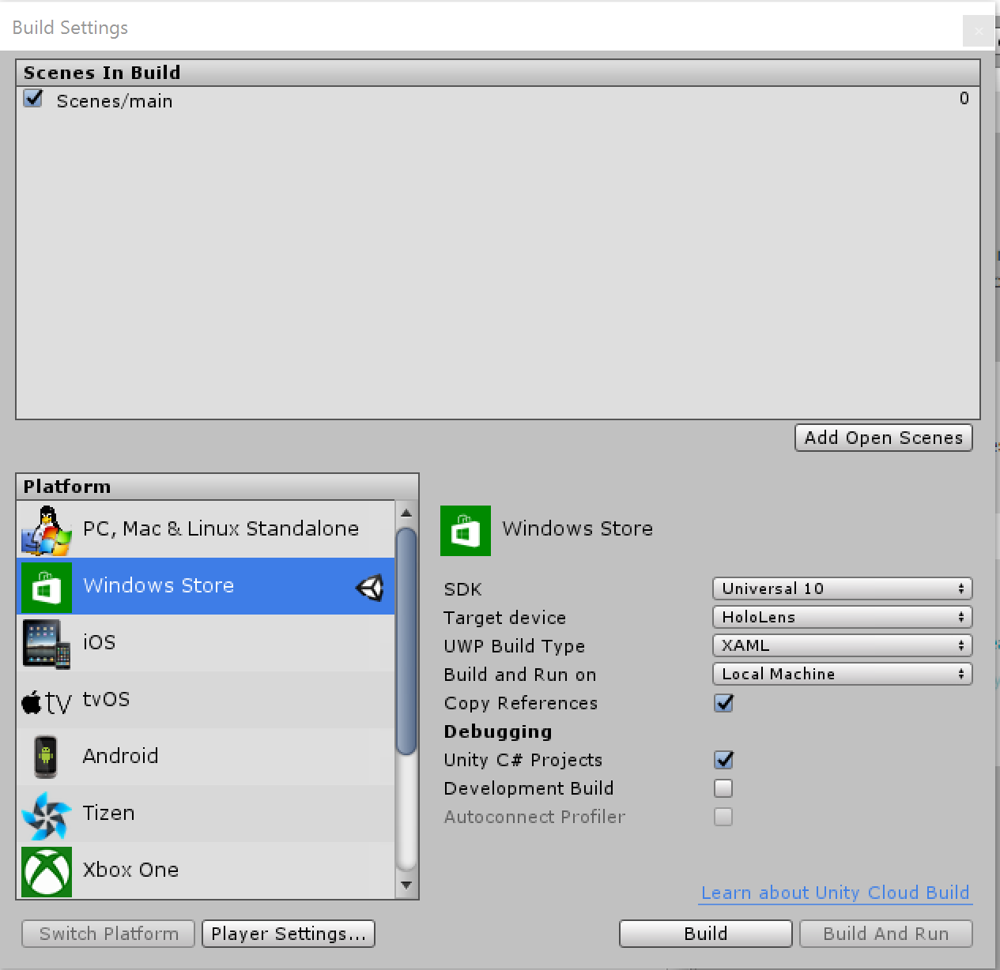
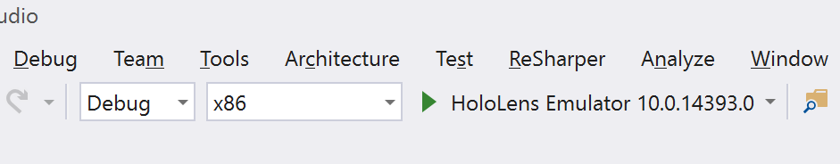

# Holographic Photo Project

## Introduction

Holographic Photo Project is a Unity Package for HoloLens users that projects holographic photos from OneDrive into a physical environment, enabling people to relive their memories in a more immersive way.

## Features

The goal of this HoloLens app experimentation was to create a holographic content hub that could be pinned in the environment and populated by content fetched from the cloud.

Holographic Photo Project enables people to relive their memories in a more immersive way using OneDrive and the Microsoft HoloLens. 

Holographic Photo Project allows you to: 
- Link OneDrive albums to 3D, holographic “souvenirs” 
- Place holographic souvenirs in your physical space 
- View your photos in 3D photo arrangements 
- Cycle through all the photos in your albums 

This app requires a OneDrive account with albums of photos, either auto-generated or user-created. In addition, the app is created for the Microsoft HoloLens and cannot be experienced without one. 
Holographic Photo Project is a Microsoft Garage project. Microsoft Garage is a cross-company initiative focused on developing new and compelling experiences. Learn more at https://www.microsoft.com/garage. 

 
## Installation Guide
To get more information regarding installation guidelines for the HoloLens, follow [this link](https://developer.microsoft.com/en-us/windows/mixed-reality/install_the_tools). 

### Clone Repository
1. Install [Visual Studio 2015 Update 3](https://my.visualstudio.com/Downloads?pid=2084). Note that this project has not been tested on Visual Studio 2017. 
2. Install [Unity 5.5](https://store.unity.com/download). 
3. Install the [Hololens Emulator](http://download.microsoft.com/download/1/4/2/142B4933-A99E-44F8-9BFD-C1DF64D984B0/emulator/EmulatorSetup.exe). 
4. Clone source `git clone https://github.com/Microsoft/Holographic-Photo-Project.git`
5. Checkout the master branch. 

### Build Project
1. Open Unity. 
2. Click “Open”. Navigate to the “Holographic-Photo-Project” folder where the repository has been cloned. Select the “src” folder and click “Select Folder”. 
3. You can also open the project from the file explorer: Holographic-Photo-Project > src > Assets > Scenes > main.unity. 
4. Once the project is open in Unity, if the main scene is not already open, use the Project navigator in the bottom left corner to open it: Assets > Scenes > main. 
5. Open the build settings: File > Build Settings… 
6. In the dialogue that pops up, check the Scenes in Build window to ensure that the main scene is checked. If it is not, click “Add Open Scenes” just below this window and check the main scene. No other scenes should be checked. 
7. Under Platform, select “Windows Store”. If you haven’t already, you may need to download it by clicking “Open Download Page”. This may take a couple of hours. 
8. Use the following settings: 
 **SDK**: Universal 10
 **Target device**: HoloLens
 **UWP Build Type**: XAML
 **Build and Run on**: Local Machine Check the boxes for **“Copy References”** and **“Unity C# Projects”**.
 * **NOTE:** Only check **"Development Build"** if you want to be in `Debug` mode in Visual Studio.

 
Unity Build Settings
  

9. Click “Build”. 
10. When the dialogue appears, select the “VSBuild” folder. 

### Deploy to Target Platform
1. Once the project finishes building, the file explorer should open. Navigate to the “VSBuild” folder and open the “HolographicPhotoProject” Visual Studio Solution. 
2. You must update the client Id in the ConfigurationManager.cs file in order to use the OneDrive C# SDK. Instructions can be found in the [OneDrive Readme](./src/Assets/HolographicPhotoProject/Data/OneDrive/Readme.md).
3. To run on the emulator, choose Release, x86, HoloLens Emulator. To run on a HoloLens device through a USB, choose Release, x86, Device.  
4. To run on a HoloLens device remotely (over WiFi), choose Release, x86, Remote Device. 
 More detailed instructions on deploying to a device can be found [here](https://developer.microsoft.com/en-us/windows/mixed-reality/using_visual_studio).

 
Visual Studio Build Settings

### Rebuilding the Project from Unity
You may need to rebuild the project from Unity for various reasons, for example, if changes are made to the main scene. Note that if changes are made to a script, you can simply rebuild and deploy from Visual Studio. 
1. Delete the folder “HolographicPhotoProject/src/VSBuild”. 
2. Checkout the “HolographicPhotoProject/src/VSBuild” folder from the repo. 
3. Follow the build steps above from Step 1.

### Troubleshooting
If you try to build or deploy and have an error related to the Assembly-CSharp.dll, there are a couple fixes you can try. 
1. In the SolutionExplorer in Visual Studio, right-click the solution and select "Clean Solution". Then, right-click the solution again and click "Rebuild Solution". 
2. Rebuild from Unity (using the instructions in the section above). 
3. Change the minimum Windows build: Project > HolographicPhotoProject Properties, change "Min version" from Build 10240 to 10586.
4. Double check the Project Dependencies: Project > Project Dependencies. The `HolographicPhotoProject` project should be dependent on both the `Assembly-CSharp` and the `Assmebly-CSharp-firstpass` projects. 

You may get the following error the first time you try to build and deploy the app: SA0001 : CoreParser : An exception occurred while parsing the file. Should this happen, simply rebuild/redeploy.  

You may get the following error even when your Hololens is connected and powered on and you try to deploy the app: Error DEP6200: Bootstrapping failed. Device cannot be found. 0x89731810: Deployment failed because no Windows Phone was detected. Make sure a phone is connected and powered on. Should this happen, simply redeploy. 

### Using the Device Portal
You can use the Windows Device Portal to view the live media stream of the HoloLens, check performance, or input using your computer keyboard. Detailed instructions on getting this set up can be found [here](https://developer.microsoft.com/en-us/windows/mixed-reality/using_the_windows_device_portal).  

## Software and Hardware Requirements
Tested development environment is Windows 10 (Build 14393) with Visual Studio Enterprise 2015 Version 14.0.25420.01 Update 3 and Unity 5.5.1f1. 

Application runtime environment is Microsoft HoloLens (10.0.14393.1083). 

This project has not been tested on any version of Visual Studio 2017. 

## Disclaimer
**There are instances of undocumented OneDrive API calls in this project. These are subject to change without any warning.** 

For more information, see the [OneDrive Readme](./src/Assets/HolographicPhotoProject/Data/OneDrive/Readme.md).

## Road Map

Holographic Photo Project is a work in progress without a clearly defined path forwards. However, here are some features that have been suggested, though not fully fleshed out, by the original team.

### Different file types

At its current state, Holographic Photo Project supports the display of photos. This could be extended to include new file types such as panoramic or 360 photos, videos, audio files, PowerPoint slidedecks, etc.

### New content sources

At its current state, Holographic Photo Project supports OneDrive, specifically OneDrive albums, to retrieve its content. This could be extended to include new content sources such as device media content, Google Photos, Facebook, Instagram, etc.

Rather than being bound simply to an album, folder, or something of the like, a hologram could be bound to a location, date, event, or tag to retrieve content from different sources. For example, a hologram could be bound to the hashtag #explorebc to display relevant content from different social media sites.

### Sharing

"Sharing" in the HoloLens is the ability for multiple people in different HoloLenses to see the same hologram. This feature could allow multiple people to view the same photos and hologram simultaneously in their environment or collaborate on the content available to the hologram.

### Notifications

Notifications within the app could allow the users to be notified for different events like a year since an album was created (and the trip was taken), or notify them when another user has added a new photo to a shared album.

### Interactive, contextual holograms

At its current state, Holographic Photo Project has static holograms. The holograms could have more contextualized audio and visual elements. For example, an Eiffel tower hologram bound to a Paris album could play relevant music or have visual effects like the time of day or weather currently in Paris.

## Contribute

Holographic Photo Project welcomes contributions from the community! To get started, please read through the [contributing](CONTRIBUTING.md) and [developer](DEVELOPER.md) guides.

This project has adopted the [Microsoft Open Source Code of Conduct](https://opensource.microsoft.com/codeofconduct/).
For more information see the [Code of Conduct FAQ](https://opensource.microsoft.com/codeofconduct/faq/) or contact [opencode@microsoft.com](mailto:opencode@microsoft.com) with any additional questions or comments.
