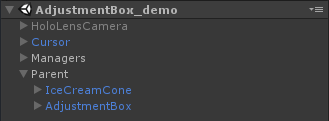
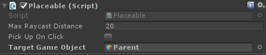
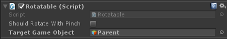
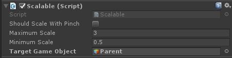

# AdjustmentBox
Can be attached to an object to perform an adjustment operation using HoloLens gestures (such as rotating, scaling and moving). This was inspired by other apps like the Hologram Store.

## How to

In order to adjust a GameObject using the adjustment box, you can follow these simple steps :
1. Create an empty GameObject.

2.  Make the adjustment box a child of the newly created GameObject by dragging the AdjustmentBox prefab located in Assets/HolographicSouvenirProject/UI/AdjustmentBox/Prefabs onto it.

3. Make the GameObject you would like to adjust, a child of the empty GameObject you created. 

4. Set the empty parent GameObject you created as the target using the `Target` property of the adjustment box's `Placeable`, `Rotatable` and `Scalable` components (located respectively in the Placer, Rotator and Scaler GameObjects). 
 
 
 

## Content

### Scripts

#### Adjustable

Component that allows moving, scaling and rotating an object. It also has a rollback feature, to cancel changes. This script expects one or more of the following components to be in the game object : Placer, Rotator or Scaler.

#### Placeable

Component that allows placing an object in the environment with the gaze.

#### Placer

Component that binds the placeable functionality to the placer view.

#### Rotatable

Component that allows rotating an object with your hand on HoloLens.

#### Rotator

Component that binds the rotatable functionality to the rotator.

#### Scalable

Component that allows scaling an object with your hand on HoloLens.

#### Scaler

Component that binds the rotatable functionality to the rotator.

#### PlacerView, RotatorView, ScalerView

Scripts written for the sole purpose of easily getting the Placer, Rotator and Scaler objects. They should be replaced by tags.

### Materials

Material used by the adjustment box prefab.

### Prefabs

#### AdjustmentBox

Can be attached to an object to perform adjustment operation using HoloLens gestures (such as rotating, scaling and moving). This was inspired by other apps like the Hologram Store.
